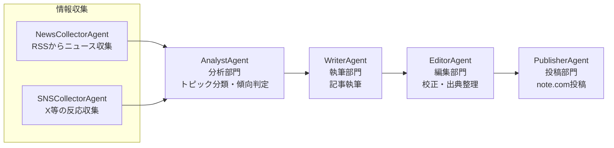

# アーキテクチャ

## 全体像

各部門を1エージェント（1クラス）として実装し、`Orchestrator` が順番に協働させることで
「収集 → 分析 → 執筆 → 校正 → 投稿」の記事生成パイプラインを構成しています。

## 部門（エージェント）の役割

| 部門 | クラス | 役割 |
|---|---|---|
| 情報収集 | `NewsCollectorAgent` | 設定されたRSSフィードから自動車関連ニュースを収集する。価格.com掲示板等の未確認情報源は`unofficial_feed_urls`に分離して指定でき、該当ニュースは`NewsItem.is_unofficial=True`となる |
| SNS反応収集 | `SNSCollectorAgent` | X(Twitter) / YouTubeコメント / 5ch 等のSNS上の反応を収集する（`SNSProvider`を差し替え・`CompositeSNSProvider`で複数組み合わせ可能） |
| 分析 | `AnalystAgent` | ニュースとSNS反応を突き合わせ、記事化する話題単位（`Topic`）に整理し、要約と反応傾向を判定する |
| 執筆 | `WriterAgent` | トピックをもとにLLMでnote.com向け記事（Markdown）を執筆する |
| 編集・校正 | `EditorAgent` | 文字数・NGワードチェック、出典セクションの付与、LLMによる校正を行う |
| 投稿 | `PublisherAgent` / `NotePublisher` | 記事をローカル保存し、設定に応じてnote.comへ下書き保存・公開する |

`Orchestrator`（`src/orchestrator.py`）はこれらのエージェントをコンストラクタで受け取り、
`run_once()` で1パイプライン分の実行を行います。各エージェントは独立したクラスなので、
モックに差し替えたユニットテストが容易です（`tests/test_pipeline.py` 参照）。

## 拡張ポイント

- **SNSプラットフォームの追加**: `SNSProvider` プロトコルを実装すれば追加のプラット
  フォームにも対応できます（`src/agents/sns_collector.py`）。標準で
  `XApiProvider`（X、有料APIが必要）、`YouTubeCommentsProvider`（YouTube公式API、
  無料枠あり）、`FiveChProvider`（5ch、設定したスレッドURLから収集・公式APIなし）
  を用意しており、`CompositeSNSProvider` で複数を組み合わせて使えます。
- **LLMプロバイダの切り替え**: `LLMClient`（`src/llm_client.py`）はAnthropic APIと
  Google Gemini API（無料枠あり）の両方に対応しており、`.env`にどちらのAPIキーが
  設定されているかで自動判定します（`config/config.yaml`の`llm.provider`で明示指定も可）。
  他プロバイダを追加する場合は `_LLMBackend` プロトコルを実装してください。
- **キーワード抽出/クラスタリングの高度化**: 現状は簡易な文字列分割によるクラスタリング
  です。精度を上げる場合は形態素解析器（Janome, MeCab等）や埋め込みベクトルによる
  類似度クラスタリングへの置き換えを検討してください（`AnalystAgent._extract_keyword`）。
- **人間によるレビュー工程の追加**: `PublisherAgent` の前段に承認ステップ（Slack通知して
  承認を待つ等）を挟むことで、完全自動投稿ではなく「人間の最終確認付き自動化」に
  することを推奨します。特にnote.comへの実公開（`publish=True`）は既定で無効化しています。
- **定期実行**: `scripts/run_pipeline.py` をcronやGitHub Actionsのscheduleトリガーから
  定期実行することで自動化できます。

## 注意事項

- SNS投稿を記事内で紹介する際は、長文の丸写しを避け、要約または短い引用＋出典明記に
  留めてください（`WriterAgent` のプロンプトにもその旨の制約を入れています）。
- 各プラットフォーム（ニュースサイト・X等）の利用規約・著作権に配慮してください。
- note.com への自動投稿は非公式な方法（ブラウザ自動操作）に依存しています。
  詳細は [`NOTE_INTEGRATION.md`](./NOTE_INTEGRATION.md) を参照してください。
