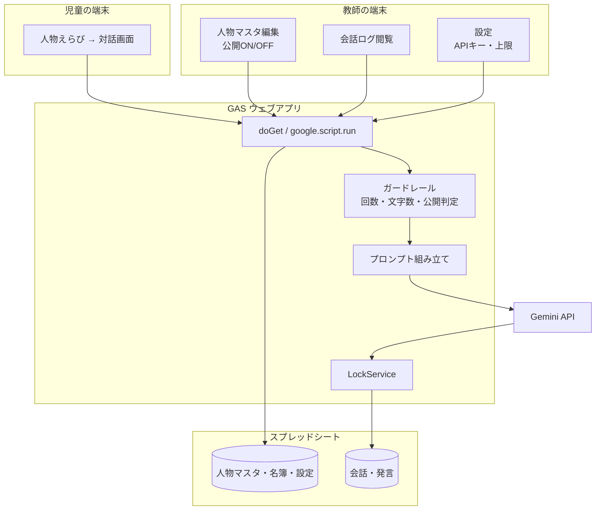

# 歴史人物チャット 構想書
## スプレッドシート × Google Apps Script による実装構想

---

## 1. コンセプトと基本方針

### 1.1 何を作るか

小学6年生が、日本史の歴史人物に**テキストメッセージを送ると、その人物が一人称で返事をしてくれる**ウェブアプリ。

教科書の中で「した人」としてしか出てこない人物に、子どもの側から問いを立てて話しかけられるようにする。
ねらいは人物の知識を覚えることではなく、**問いを立てること**と、**返ってきた話を鵜呑みにしないこと**の両方にある。

- **データベース**: Google スプレッドシート（1クラス＝1ファイル）
- **アプリ本体**: GAS ウェブアプリ（`HtmlService`）
- **応答生成**: Gemini API（`UrlFetchApp` で呼び出し）
- **配信対象**: Google Workspace for Education のアカウント

### 1.2 SRLアプリとの関係

同じリポジトリに同居するが、**完全に独立したアプリ**として作る。

| | 共有するか |
|---|---|
| スプレッドシート | しない（別ファイル） |
| GASプロジェクト・デプロイ | しない（別 scriptId・別URL） |
| コード | しない（`history-chat/src/` に独立して置く） |
| 設計の流儀 | **する**（UUID主キー、`LockService` 直列化、シートをマスタにする、APIキーは `ScriptProperties`） |

SRLアプリを導入していない先生でも、これ単体で授業に持ち込める状態を保つ。

### 1.3 「話す」の設計 ── 語るが、推測は推測と断る

歴史人物チャットには、両極の作り方がある。

- **史実に厳密**にすると、「わからぬ」ばかりで会話が死ぬ
- **キャラクター重視**にすると、子どもが作り話を史実として持ち帰る

採るのは中間で、**豊かに語らせたうえで、根拠の有無を人物自身に言わせる**。

> 「安土に城を建てたのは、まことだ。天守からは琵琶湖がよう見えた。
> ── で、そちの言う『天下統一をどう思うか』か。**これは記録に残っておらぬゆえ、わしの言葉と思うて聞け。**……」

この一線が、このアプリの性格そのものになる。史料にあることと、そうでないことの境目を、
人物の口から毎回引かせる。子どもは「調べないと分からないことがある」に自分で当たる。

---

## 2. 前提（合意事項）

| 項目 | 決定 |
|---|---|
| 対象 | 小学6年生・社会科「日本の歴史」。ふりがな前提のやさしい語彙 |
| 利用者 | **段階導入**。まず教師デモ、ガードレールを整えてから児童開放 |
| 人物 | 固定セットを初期投入し、**教師がシートで追加**できる |
| 応答方針 | 一人称で語る。史料にないことは「記録にはないが」と断ってから話す |
| ログ | 保存し、**教師が全員分を閲覧できる**。児童画面に「先生が見ています」と常時明示 |
| 認証 | 学校Googleアカウント。`access: DOMAIN` / `executeAs: USER_DEPLOYING` |
| APIキー | `PropertiesService.getScriptProperties()`。**未設定でもアプリは壊れない** |

### 2.1 GASの制約と設計判断

| 制約 | 対策 |
|---|---|
| ストリーミング応答ができない | 「筆をとっている…」の待ち演出で代替。1回の応答を3〜5文に抑え、体感の待ち時間を短くする |
| 実行時間 6分／リクエスト | 1リクエスト＝1往復。Gemini 呼び出しは `muteHttpExceptions` ＋タイムアウト時の再送なし（二重課金と二重投稿を避ける） |
| `UrlFetchApp` の1日あたり上限 | 1人あたりの1日往復数に上限を設ける（既定30往復）。上限は設定シートで変更可 |
| 同時書き込みで行がずれる | 書き込みは `LockService` で直列化。主キーは `Utilities.getUuid()`、行番号に依存しない |
| 発言シートが数千行に育つ | 教師の閲覧は会話単位で範囲取得。人物マスタと設定は `CacheService` に載せる |

---

## 3. システム全体像



**1往復の流れ**

1. 児童が文を送る → サーバーがガードレールを通す（公開人物か／文字数／本日の残り回数）
2. 人物マスタの設定と、直近の数往復を組んでプロンプトを作る
3. Gemini を呼ぶ
4. 児童の発言と人物の返事を、**まとめて1回のロックで**発言シートに追記
5. 返事を画面に返す

失敗したときは、**児童の発言も保存しない**。「もう一度おくってみて」と出して、往復を消費させない。

---

## 4. データモデル（シート設計）

### 4.1 マスタ系（教師が編集／アプリが参照）

**`名簿` (Users)**
| user_id | 氏名 | 表示名 | 出席番号 | 役割(teacher/student) | 端末アカウント(email) |

**`人物マスタ` (Figures)** ── このアプリの中心
| 列 | 役割 |
|---|---|
| `figure_id` | 主キー（例 `F-01`） |
| `表示名` | 織田信長 |
| `よみ` | おだ のぶなが（ふりがな表示に使う） |
| `時代` | 戦国 |
| `一言紹介` | 天下統一をめざした戦国大名。カード一覧に出す |
| `顔アイコン` | 絵文字1つ（画像を持たない。読み込みが軽く、著作権の心配もない） |
| `一人称` | わし |
| `口調メモ` | 短く断定的。人をためすような物言い。「〜であるか」「〜せい」 |
| `事実メモ` | **教科書レベルの事実を箇条書き**。人物が自信を持って語ってよい範囲そのもの |
| `避ける話題` | 本能寺での最期の描写／宗教の是非 |
| `公開` | TRUE/FALSE。教師がここで見せる人物を絞る |
| `並び順` | カード一覧の並び（時代順） |

`事実メモ` が品質を決める。ここに書いたことだけが「記録にある」扱いになり、
書いていないことは人物が断りを入れてから話す。教師が単元に合わせて足せる。

**`設定` (Settings)**
| キー | 値 | 既定 |
|---|---|---|
| `model` | 使う Gemini モデル | — |
| `1日の往復上限` | 児童1人あたり | 30 |
| `入力文字数上限` | 1メッセージ | 120 |
| `履歴の往復数` | プロンプトに含める直近の往復 | 6 |
| `注意書き` | 児童画面に出す文言 | 下記 7.3 |

APIキーだけはシートに置かない（教師も含め誰の目にも触れさせない）。`ScriptProperties` に持つ。

### 4.2 記録系（アプリのみが書き込む）

**`会話` (Conversations)**
| conversation_id | user_id | figure_id | 開始時刻 | 最終更新 | 往復数 |

**`発言` (Messages)**
| message_id | conversation_id | 話者(child/figure) | 本文 | 時刻 | 教師フラグ |

`教師フラグ` は、教師がログを見て気になった発言に立てる印。授業後に拾い直すためのもので、
児童側には見えない。

---

## 5. 画面構成

### 5.1 児童用

**① 人物えらび**

```
┌──────────────────────────────────┐
│  だれと 話す？                      │
│                                   │
│  🔮 卑弥呼      👑 聖徳太子         │
│  弥生時代       飛鳥時代            │
│                                   │
│  📜 紫式部      🏹 源頼朝           │
│  平安時代       鎌倉時代            │
└──────────────────────────────────┘
```

- 公開されている人物だけがカードで並ぶ（時代順）
- カードは 顔アイコン＋表示名（ふりがな）＋時代＋一言紹介

**② 対話画面**

- LINE風の吹き出し。人物の発言は左、自分は右
- 入力欄の上に**残り回数**（「きょうは あと 12かい 話せます」）
- 送信後は「✍️ 筆をとっています…」を人物側の吹き出しに出す
- 上部に常時「**このやりとりは 先生が 見ています**」
- **最初の一言はこちらから出す**（「なんじゃ、そちは。何が聞きたい」）。空の入力欄より問いが出やすい
- 何を聞けばいいか分からない子のために、**質問のたね**を3つ出す（人物ごとに用意）
  - 例（信長）: 「どうして 城を つくったの？」「いちばん こまったことは？」「家来から どう見られていた？」

### 5.2 教師用

**A. 人物マスタ** ── 一覧で公開ON/OFFを切り替え、行を開いて口調・事実メモ・避ける話題を編集。シートを直接触ってもよい。

**B. 会話ログ** ── 児童別／人物別に、新しい順。会話を開くと往復がそのまま読める。気になる発言にフラグ。
「どんな問いが生まれたか」を授業に戻すのが本来の使い道で、監視はその副産物。

**C. 設定** ── APIキーの登録（伏せ字表示）、上限値、注意書き文言。**キー未設定のときはここに大きく案内を出す**。

---

## 6. プロンプト設計

人物マスタの各列を、そのままシステムプロンプトに流し込む。

```
あなたは〈表示名〉です。〈時代〉に生きた人物として、一人称で話してください。
一人称は「〈一人称〉」。話し方: 〈口調メモ〉

【あなたが確かに知っていること】
〈事実メモ〉

【守ること】
1. 上の「確かに知っていること」は、自信をもって語ってよい。
2. そこに書かれていないが、あなたの時代・立場から言えそうなことは、
   「記録には残っておらぬが」等と断ってから話す。断りは必ず入れる。
3. あなたが死んだ後の出来事は「わしの死んだあとのことは、わからぬ」と答える。
   現代の物事について知ったふりをしない。
4. 相手は小学6年生。むずかしい言葉には、短い言い換えをそえる。
5. 返事は3〜5文。長く語らない。
6. 次の話題には触れない。向けられたら、やんわり別の話に戻す: 〈避ける話題〉
7. 相手が名前や住所などの個人的なことを書いてきても、それには触れない。
```

**設計上の判断**

- **ふりがなはHTMLで出さない**。`ruby` タグを生成させると崩れるので、
  難語には括弧書きの言い換えを添えさせる（「関白（かんぱく。天皇をたすける一番えらい役）」）。
  人物名のふりがなは、人物マスタの `よみ` 列から画面側で付ける。
- **履歴は直近6往復**。それ以前は落とす。小6の1回の授業ならこれで足りる。
- **児童の氏名はプロンプトに入れない**。名簿と会話ログは `user_id` で結び、Gemini には送らない。
- 応答は平文。整形はクライアント側でやる。

---

## 7. 安全設計

### 7.1 何を防ぐか

| リスク | 対策 | 残る限界 |
|---|---|---|
| もっともらしい嘘 | 事実メモを根拠として渡す。推測は明示させる | 消えない。**教師が「これは本当か調べよう」に持っていく前提で使う** |
| 扱いの難しい話題 | 人物マスタの `避ける話題`＋人物ごとの公開ON/OFF。初期セットは近代より前に絞る | プロンプトによる制御なので、突破されうる。ログで発見する |
| 不適切な入力 | 文字数上限、回数上限、全ログを教師が閲覧 | 事前ブロックはしない。事後に見つける設計 |
| 個人情報の送信 | 初回の注意書き、プロンプト側で反応させない | **児童が自分で書いた分は防げない**（7.3） |
| クォータ超過 | 1人あたりの1日上限。失敗時は往復を消費させない | — |

### 7.2 初期人物セット（近代より前）

明治以降の人物は、扱いが定まってから第4段階で足す（9章）。まずは12人。

| | 人物 | 時代 |
|---|---|---|
| 🔮 | 卑弥呼 | 弥生 |
| 👑 | 聖徳太子（厩戸皇子） | 飛鳥 |
| 🏛 | 藤原道長 | 平安 |
| 📜 | 紫式部 | 平安 |
| 🏹 | 源頼朝 | 鎌倉 |
| ⚔️ | 北条時宗 | 鎌倉（元寇） |
| 🏯 | 足利義満 | 室町 |
| 🖌 | 雪舟 | 室町 |
| 🔥 | 織田信長 | 戦国 |
| 🌾 | 豊臣秀吉 | 戦国 |
| 🍵 | 徳川家康 | 江戸 |
| 📖 | 杉田玄白 | 江戸（蘭学） |

### 7.3 児童に伝えること

対話画面の上部に常時：

> このやりとりは 先生が 見ています。
> 名前や 住所など、じぶんのことは 書かないでね。

初回起動時に一度、全画面で：

> ここで 話す人は、**本物の 歴史人物では ありません**。
> コンピュータが、のこっている 記録をもとに「その人ならこう言うかも」と 考えて 返事をします。
> **「記録にはないが」と 言われたら、それは たしかめられていない話**です。
> 大事なことは、教科書や 資料で たしかめてね。

この文面は設定シートで変更できる。

---

## 8. リポジトリ構成

```
history-chat/
  docs/CONCEPT.md      ← 本書
  src/                 ← GASプロジェクト（clasp管理）
    appsscript.json
    Code.gs            doGet / ルーティング
    Constants.gs       シート名・列定義・既定値
    Repo.gs            シート読み書き（UUID・LockService）
    Auth.gs            名簿照合・役割判定
    Setup.gs           シート初期化・初期人物セット投入
    Figures.gs         人物マスタの読み書き
    Chat.gs            ガードレール・プロンプト組み立て・Gemini呼び出し
    TeacherApi.gs      ログ閲覧・設定
    child.html         人物えらび／対話画面
    teacher.html       人物マスタ／ログ／設定
    css.html
    unauthorized.html
```

SRLアプリとは別の GASプロジェクトなので、`.clasp.json` も別に持つ（`rootDir` は `./history-chat/src`）。
2つのプロジェクトを同じリポジトリから push するため、**clasp の切り替え手順は `history-chat/README.md` に書く**。

---

## 9. 開発ロードマップ

| 段階 | 作るもの | 終わりの合図 |
|---|---|---|
| **第1段階**<br>教師デモ | シート初期化、人物マスタ＋初期12人、対話画面、Gemini接続、ログ保存 | 教師機で信長と話せて、シートにログが残る |
| **第2段階**<br>ガードレール | 回数・文字数上限、公開ON/OFF、教師のログ閲覧画面、注意書き | 上限に当たったときの挙動まで含めて確かめられる |
| **第3段階**<br>児童開放 | 名簿連携、児童ごとのログ分離、質問のたね、待ち演出 | 1クラスで同時に使って落ちない |
| **第4段階**<br>授業で使う | 人物追加の手引き、近代人物の慎重な追加、「みんなの問い」の共有 | 単元を1つ通せる |

第1段階は教師機だけを相手にするので、名簿も回数制限も要らない。**まず信長と話せる状態を作る**のが最短で、
そこで応答の手ざわり（口調、長さ、断りの入り方）を見てからプロンプトを詰める。

---

## 10. 未決の事項

- **学校のAI利用方針の確認** ── 児童の自由記述が外部APIに送られる。導入前に確認が要る
- **Gemini APIの契約形態** ── 無料枠で1クラス分がまかなえるか、実測してから決める
- **近代の人物をどう扱うか** ── 第4段階までに、公開する人物と避ける話題の線引きを決める
