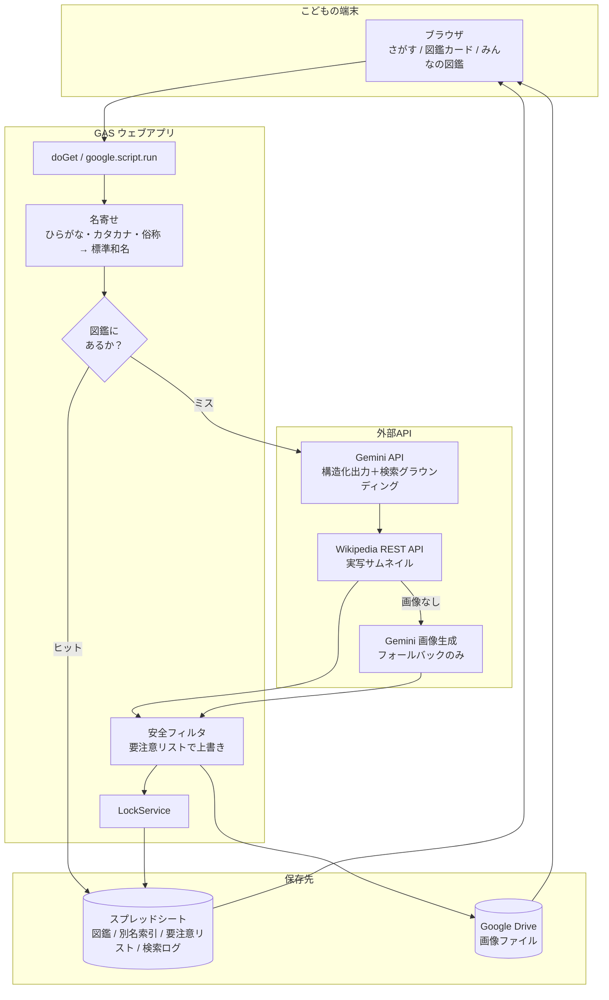
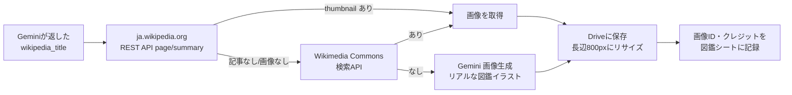

# いきもの図鑑アプリ 構想書
## Gemini API × スプレッドシート × Google Apps Script による実装構想

> **フェーズ1（本書）＝構想。フェーズ2＝実装。**

---

## 1. コンセプトと基本方針

### 1.1 何を作るか

子供が生き物の名前を入れて「しらべる」を押すと、**生息地・捕まえ方・餌・飼い方**が図鑑のカードになって出てくる Web アプリ。
調べた生き物は**みんなの図鑑**に蓄積され、いつでも見返せる。

- **対象**: 小学生（家庭で親子・個人利用）
- **情報の生成**: Gemini API（構造化出力＋Google検索グラウンディング）
- **写真**: Wikipedia / Wikimedia Commons の実写を優先、無ければ AI 生成イラストで補完
- **データベース**: Google スプレッドシート（全ユーザー共有の1ファイル）
- **アプリ本体**: GAS ウェブアプリ（`HtmlService` による SPA）
- **ログイン**: 不要（匿名アクセス可でデプロイ）

### 1.2 核となる設計思想 —— 「図鑑は育つ」

このアプリの最大の設計上の勘所は、**AI に毎回聞かないこと**。

```
ユーザーが「かぶとむし」と入力
  → まず【みんなの図鑑】シートを探す
      → あった：シートから即座に表示（API 呼び出しゼロ、0.5秒）
      → なかった：Gemini に聞く → 画像を取る → シートに追記（15〜25秒）
```

日本の子供が調べる身近な生き物は**数百種で頭打ち**になる。運用が進むほどヒット率が上がり、
API コストも待ち時間もクォータ消費も逓減していく。「みんなで図鑑を育てる」という体験価値と、
技術的なコスト最適化が、同じ設計から出てくる。

### 1.3 なぜ GAS ＋ スプレッドシートか

| 観点 | 利点 |
|---|---|
| APIキーの保護 | Gemini の API キーは **`ScriptProperties` に置き、GAS がサーバー側で中継**する。子供の端末に鍵が渡らない。静的Webアプリでは実現できない最重要ポイント |
| 導入コスト | サーバー不要・無料。Google アカウント1つあればデプロイできる |
| データの透明性 | 保護者がシートを直接開けば、子供が何を調べたか全て見える。誤情報の修正も**セルを直接書き換えるだけ** |
| 画像の置き場 | Google Drive にそのまま保存でき、GAS から署名なしで配信できる |
| 保守性 | 「要注意リスト」などの安全マスタを、コードを触らずシート上で更新できる |

### 1.4 GAS の制約と、それを踏まえた設計判断

個人（gmail.com）アカウントでのデプロイを前提とする。

| 制約 | 実測値の目安 | 対策 |
|---|---|---|
| スクリプト実行時間の総量 | **90分/日**（個人アカウント） | キャッシュヒット時は約1秒で完了。新規登録のみ20秒前後を消費。1日あたり新規200種＋閲覧多数でも収まる |
| 1リクエストの実行時間上限 | 6分 | Gemini生成15秒＋画像取得5秒＝25秒程度。上限には余裕がある |
| `UrlFetchApp` 呼び出し | 20,000回/日 | キャッシュ優先により実質的に問題にならない |
| `UrlFetchApp` の通信量 | **100MB/日** | 画像を毎回外部から取ると即枯渇する。**取得した画像は Drive に1回だけ保存し、以後は Drive から配信**する |
| 同時書き込みで行がずれる | — | 図鑑への追記は `LockService` で直列化。行の特定は `creature_id`（UUID）で行い行番号に依存しない |
| 匿名アクセス | Workspace アカウントでは外部共有が制限される場合あり | **個人 Google アカウントからデプロイ**し、「アクセスできるユーザー：全員」「実行するユーザー：自分」に設定 |

---

## 2. 実現可能性の検証結果

ユーザーからの「これらの機能は実現可能か」への回答。

| 要件 | 可否 | 根拠・手段 |
|---|---|---|
| 名前を入力 → 項目ごとに図鑑表示 | ✅ | Gemini API の **構造化出力**（`responseSchema` に JSON Schema を指定）で、生息地・捕まえ方・餌・飼い方を**必ず同じフィールド構成で**受け取れる。パース失敗やフィールド欠落が起きない |
| 情報の正確さ | ✅ | **Google 検索によるグラウンディング**を併用。Gemini 3 系より構造化出力とグラウンディングの**併用が可能**（従来は排他だった）。出典URLも同時に取得しシートに保存する |
| 写真の表示 | ⚠️→✅ | **Gemini API は写真を返さない**（テキスト生成のみ）。別系統が必須。Wikipedia REST API（`page/summary`）から実写サムネイル＋原寸URLを取得。APIキー不要・無料。見つからない場合のみ画像生成にフォールバック |
| 過去の検索を保存・参照 | ✅ | スプレッドシートに1種＝1行で蓄積。全ユーザー共有 |

**唯一の技術的な断層は「写真」**であり、これは Gemini 以外の情報源で解決する。

---

## 3. システム全体像



---

## 4. 生き物データのスキーマ（Gemini 構造化出力）

Gemini に渡す `responseSchema`。**このスキーマ設計がアプリの品質をほぼ決める。**

```jsonc
{
  "type": "object",
  "required": ["is_creature", "canonical_name", "reading", "aliases", "category",
               "summary", "habitat", "catching", "food", "keeping",
               "danger_level", "danger_notes", "legal_status", "release_warning",
               "keeping_difficulty", "wikipedia_title"],
  "properties": {
    "is_creature":   { "type": "boolean",
                       "description": "入力が実在する生き物を指しているか。偽なら以下は空でよい" },
    "canonical_name":{ "type": "string", "description": "標準和名（例：オカダンゴムシ）" },
    "reading":       { "type": "string", "description": "ひらがな読み" },
    "aliases":       { "type": "array", "items": { "type": "string" },
                       "description": "俗称・別表記（例：だんごむし、団子虫、まるむし）" },
    "category":      { "enum": ["むし", "さかな", "かえる・とかげ・へび", "とり",
                                "けもの", "みずのいきもの", "そのほか"] },

    "summary":       { "type": "string", "description": "2〜3文の紹介" },
    "habitat":       { "type": "object", "required": ["places", "season", "text"],
                       "properties": {
                         "places": { "type": "array", "items": { "type": "string" },
                                     "description": "石の下、公園の花だん など" },
                         "season": { "type": "string", "description": "見られる時期" },
                         "text":   { "type": "string" } } },
    "catching":      { "type": "object", "required": ["tools", "steps", "text"],
                       "properties": {
                         "tools": { "type": "array", "items": { "type": "string" } },
                         "steps": { "type": "array", "items": { "type": "string" } },
                         "text":  { "type": "string" } } },
    "food":          { "type": "object", "required": ["items", "frequency", "text"],
                       "properties": {
                         "items":     { "type": "array", "items": { "type": "string" } },
                         "frequency": { "type": "string", "description": "毎日／2〜3日に1回 など" },
                         "text":      { "type": "string" } } },
    "keeping":       { "type": "object", "required": ["container", "environment", "cautions", "text"],
                       "properties": {
                         "container":   { "type": "string" },
                         "environment": { "type": "string", "description": "土・水・温度・日当たり" },
                         "cautions":    { "type": "array", "items": { "type": "string" } },
                         "text":        { "type": "string" } } },

    // ---- ここから下が安全のための必須フィールド ----
    "danger_level":  { "enum": ["safe", "caution", "danger"],
                       "description": "danger＝素手で触ってはいけない" },
    "danger_notes":  { "type": "array", "items": { "type": "string" },
                       "description": "毒・咬傷・かぶれ・アレルギーなど具体的に" },
    "legal_status":  { "enum": ["none", "conditional_invasive", "invasive_banned",
                                "protected", "permit_required"] },
    "release_warning":{ "type": "boolean",
                       "description": "野外に放してはいけない生き物か" },
    "keeping_difficulty": { "enum": ["easy", "normal", "hard", "not_recommended"] },

    "wikipedia_title": { "type": "string", "description": "日本語版Wikipediaの正確な記事名" },
    "sources":       { "type": "array", "items": { "type": "string" } }
  }
}
```

### 4.1 このスキーマの意図

- **`is_creature`** —— 匿名公開アプリでは「あああ」「うんち」等が必ず入力される。偽なら図鑑に保存せず、「その生き物は見つからなかったよ」を返す。ゴミデータの流入を入口で止める。
- **`canonical_name` と `aliases`** —— 共有図鑑の生命線。「だんごむし」「ダンゴムシ」「団子虫」「まるむし」を**同じ1行**に名寄せする。別名は索引シートに全て登録し、次からキャッシュヒットさせる。
- **`wikipedia_title`** —— 画像取得の精度を決める。「かぶとむし」で Wikipedia を引くより、Gemini に「カブトムシ」という正確な記事名を返させてから引くほうが遥かに当たる。
- **`danger_level` / `legal_status`** を**必須**にしている点が要。任意フィールドにすると、モデルは危険な生き物ほど饒舌に飼い方を語り、警告を省略しがちになる。

---

## 5. 安全設計 —— 子供向けアプリとしての最重要要件

「捕まえ方」「飼い方」を子供に提示するアプリは、**AI の間違いが実害に直結する**。
以下の三層で守る。

### 第1層：人手の「要注意リスト」が AI より優先する

スプレッドシートに `要注意リスト` マスタを持ち、**AI の出力を無条件に上書き**する。
ハルシネーション対策の最後の砦であり、コードを変えずに保護者が追記できる。

| 標準和名 / 別名 | 危険度 | 表示メッセージ | 捕獲・飼育 |
|---|---|---|---|
| スズメバチ類 | danger | さされるととてもあぶない。ぜったいに近づかないで | 禁止表示 |
| ムカデ、セアカゴケグモ、カバキコマチグモ | danger | かまれると強い毒がある | 禁止表示 |
| ヒキガエル、イモリ、ヒョウモンダコ、カツオノエボシ | danger | 毒がある。さわったら手をあらう／触らない | 禁止表示 |
| マムシ、ヤマカガシ | danger | 毒ヘビ。見つけたらすぐはなれる | 禁止表示 |
| 特定外来生物（ウシガエル、カミツキガメ、アライグマ 等） | — | **法律で飼うことが禁止されています** | 飼育不可 |
| アメリカザリガニ、アカミミガメ | caution | 飼ってもいいけど、**外ににがすのは法律違反** | 放出厳禁を常時表示 |
| 天然記念物・保護種（ゲンゴロウ、ミヤコタナゴ 等） | — | つかまえてはいけない生き物です | 捕獲不可 |

> アメリカザリガニとアカミミガメは 2023年6月から**条件付特定外来生物**。家庭で飼うことは許可なくできるが、
> 野外への放出・販売・購入は禁止。子供が最もよく捕まえる生き物であるため、この扱いは特に丁寧に実装する。

### 第2層：危険度に応じて画面の構成そのものを変える

- **`danger` の場合、「捕まえ方」カードを表示しない。** 代わりに赤い全幅バーで「さわらないで！」を最上部に出す。
  捕まえ方を小さく併記するのではなく、**存在させない**。
- **`legal_status` が `invasive_banned` / `protected` の場合、「飼い方」カードを表示しない。** 理由を子供の言葉で説明する。
- **`release_warning` が真の場合**、飼い方カードの末尾に「そとに にがしてはいけません」を固定表示。
- **`keeping_difficulty` が `not_recommended` の場合**、「おうちで飼うのはむずかしい生き物。観察して、もといた場所にかえしてあげよう」を出す。

### 第3層：プロンプト側の制約

システムプロンプトで以下を課す。
- 小学生が読む前提。断定できないことは書かない
- 素手での捕獲を勧める前に必ず危険性を評価する
- 飼育が法律で規制されている可能性があれば `legal_status` を必ず立てる
- 生き物の命を大切にする姿勢（観察したら元の場所に返す）を `keeping` に含める

### 補足：匿名公開ゆえのモデレーション

ログイン不要のため、共有図鑑は誰でも書き込める。
- `is_creature` が偽なら保存しない（第一の関門）
- NGワードの入力フィルタ
- 図鑑シートに `status` 列（`published` / `hidden`）を持ち、保護者が `hidden` にすれば即座に非表示
- `検索ログ` シートに全入力を記録（保護者が異常に気づける）

---

## 6. データモデル（シート設計）

**`図鑑` (Creatures)** —— 1種＝1行
| creature_id | 標準和名 | よみ | カテゴリ | 概要 | 生息地_json | 捕まえ方_json | 餌_json | 飼い方_json | 危険度 | 危険メモ | 法規制 | 放出禁止 | 飼育難易度 | 画像ID | 画像種別(photo/ai) | 画像クレジット | 出典URL | 初回登録日時 | 閲覧回数 | status |

**`別名索引` (Aliases)** —— 名寄せ用。1別名＝1行
| 別名（正規化済み） | creature_id |

> 正規化＝カタカナ→ひらがな変換、全角半角統一、記号除去。
> 「ダンゴムシ」「団子虫」「まるむし」が全て同じ `creature_id` を指す。

**`要注意リスト` (SafetyOverrides)** —— 人手管理・AIより優先
| 名前パターン | 危険度 | 法規制 | 表示メッセージ | 捕獲を隠す | 飼育を隠す |

**`検索ログ` (SearchLog)**
| 日時 | 入力文字列 | ヒット種別(cache/new/notfound) | creature_id | 所要ミリ秒 |

**Google Drive**：`画像ID` は Drive のファイルID。GAS が `getBlob()` を base64 で返すか、
公開設定した Drive の直リンクを `` に渡す。**外部URLへのホットリンクはしない**（通信量クォータと表示速度のため）。

---

## 7. 画像取得パイプライン



- **実写優先**：`https://ja.wikipedia.org/api/rest_v1/page/summary/{title}` は APIキー不要、`thumbnail.source` と `originalimage.source` を返す。日本の身近な生き物はほぼ網羅されている。
- **ライセンス遵守**：Wikimedia の画像は CC BY-SA / パブリックドメイン等。**作者名とライセンス名を図鑑カード下部に小さく表示**する（`画像クレジット` 列）。これは省略できない。
- **AI生成は最後の手段**：フォールバックに限定すればコストは僅少。生成画像には必ず「AIがかいたイラストだよ」のバッジを付け、実写と混同させない。
- **リサイズして保存**：原寸は数MBある。長辺800pxに落として Drive に置くことで、通信量クォータと表示速度の両方を守る。

---

## 8. 画面構成

> **動くプレビュー：[mockups/ui-prototype.html](mockups/ui-prototype.html)**
> 5画面と、危険度・法規制の異なる4種（カブトムシ／スズメバチ／アメリカザリガニ／ウシガエル）を
> 切り替えて、§5 の安全設計が画面上でどう効くかを確認できる。
> デザインコンセプトは**「標本箱」**——方眼紙の地、標本ラベル、引き出しのグリッド。
> 子供向けを原色の玩具的な見た目に短絡させず、本物の図鑑の手ざわりを持たせている。

### 8.0 前提とする画面：Chromebook 横画面

**GIGA標準の Chromebook は 1366×768。** Chrome のタブ＋ツールバー（約68px）と
ChromeOS のシェルフ（約48px）を引くと、アプリが実際に使えるのは **1366×650** しかない。

**「横は広いが、縦は極端に狭い」** —— これが全レイアウトの制約になる。
縦を食う要素は、すべて横に逃がす。

| 課題 | 対策 |
|---|---|
| 画面下のタブバーが縦を60px以上食う | **左のナビレール**（幅96px）に移す |
| 図鑑カードを縦1列にすると4回スクロールが要る | **左右2段組**。左＝標本プレート（図・名前・カテゴリ）は固定、右＝解説だけがスクロール。**写真と名前が常に見えたまま**読める |
| 4項目を縦積みすると画面に入らない | **2×2グリッド**。1画面にほぼ収まる |
| 危険情報の箇条書きが縦を100px以上食う | 警告バー内の箇条書きを**横並び**に |
| 一覧が3列だと横が余る | `auto-fill` で**6列前後**に追従 |

### 8.0.1 Chromebook で顕在化する最大の障壁：日本語入力

スマホと違い、**Chromebook にはフリック入力がない。** 日本語を打つには IME を切り替えて
**ローマ字入力**する必要があり、ローマ字を習っていない低学年にとって、
ここが検索そのものより高い壁になる。**この対策なしでは低学年が自力で使えない。**

対策として、横画面の余白に**五十音のひらがなキーボードを常設**する。
「゛てんてん」「゜まる」「ちいさく」は直前の1文字を変換する方式にして、
**50キー＋4キー**だけで濁音・半濁音・拗音まで打てるようにする（プレビューで実装済み）。

### 画面1：さがす（トップ）
- 大きな検索窓（`placeholder="いきものの なまえを いれてね"`）
- **ひらがな入力でOK**（内部で名寄せ）
- 「よく しらべられる いきもの」ボタン群（カブトムシ、ダンゴムシ、ザリガニ、カナヘビ、メダカ…）＝タイプせずに始められる
- 検索中：「さがしています…」のアニメーション（新規は20秒前後かかるため、待たせる演出が必須）

### 画面2：図鑑カード（結果）
```
┌─────────────────────────────┐
│  【赤バー】さわらないで！ どくがあるよ    │ ← danger時のみ
├─────────────────────────────┤
│         [ 写真 ]                        │
│      カブトムシ（かぶとむし）           │
│      むし                               │
│  「日本でいちばん人気の…」              │
├──────────┬──────────┤
│ 🏞 すんでいるところ │ 🥅 つかまえかた   │
│ 🍽 たべもの        │ 🏠 かいかた       │
└──────────┴──────────┘
        写真：◯◯氏 / CC BY-SA 4.0
```
- 4項目を大きなカードで並べる。項目ごとに絵文字アイコンと色
- 危険度・法規制のバーは**カードより上**に固定
- 全文に**ふりがな（ruby）**

### 画面3：みんなの図鑑（一覧）
- グリッド表示（写真＋名前）
- カテゴリで絞り込み：むし／さかな／かえる・とかげ・へび／とり／けもの／みずのいきもの

> **`みずのいきもの`（海・川・池をまとめる）はUIプレビューの制作中に判明した修正点。**
> 当初の enum は `うみのいきもの` しか持たず、アメリカザリガニやメダカが「そのほか」に
> 落ちてしまっていた。子供が最もよく捕まえる層がここであるため、海に限定せず水辺全体を
> 受けるカテゴリに変更した。
- 「あたらしく くわわった いきもの」を先頭に。**図鑑が育っていく実感**がこのアプリの体験の核

---

## 9. 子供向けUIの方針

| 論点 | 方針 |
|---|---|
| 漢字 | 全文に ruby でふりがな。Gemini には `reading` を返させ、本文の漢字語にはクライアント側で ruby を付与 |
| 文章の難しさ | システムプロンプトで「小学校2〜4年生が読む文章」と指定。1文を短く |
| 入力の揺れ | ひらがな・カタカナ・漢字・俗称すべて受け付ける（名寄せ層で吸収） |
| 日本語入力 | **五十音のひらがなキーボードを常設**（§8.0.1）。ローマ字を習っていない低学年の生命線 |
| タップ領域 | ボタンは最小 46px。Chromebook はタッチ／トラックパッド両対応のため、マウスホバーの手がかりも付ける |
| 文字サイズ | 本文 15〜17px（Chromebook は膝上〜机上の視距離。スマホより小さくてよい） |
| 待ち時間 | 20秒を退屈させない演出（虫めがねが動く等）。キャッシュヒット時は即時 |
| 読み上げ | 将来：`SpeechSynthesis` で「よみあげ」ボタン（低学年が一人で使える） |

---

## 10. コストとクォータの試算

前提：Gemini API は無料枠あり。画像生成のみ従量課金。

| シナリオ | 新規登録 | キャッシュヒット | Gemini呼び出し | GAS実行時間 |
|---|---|---|---|---|
| 運用初月（種が少ない） | 1日30種 | 1日20回 | 30回/日 | 約12分/日 |
| 運用3ヶ月後（300種蓄積） | 1日3種 | 1日50回 | 3回/日 | 約2分/日 |

- 個人アカウントの上限 **90分/日** に対して十分な余裕がある。
- **画像生成は Wikipedia でヒットしなかった場合のみ**なので、実際には新規登録の1〜2割程度に留まる見込み。
- 最大のリスクは「運用初期に大量アクセスが来る」ケースだが、家庭利用のため現実的には起こらない。

---

## 11. 開発ロードマップ

### フェーズ2：MVP（動くものを最短で）
1. スプレッドシート初期化スクリプト（`Setup.gs`）—— 4シートとヘッダを自動生成
2. Gemini API 呼び出し層（`GeminiApi.gs`）—— 構造化出力＋検索グラウンディング
3. 名寄せ・キャッシュ層（`Repo.gs`）—— 正規化、別名索引、`LockService` による追記
4. 安全フィルタ層（`Safety.gs`）—— 要注意リストによる上書き
5. 画像取得層（`Images.gs`）—— Wikipedia → Commons → 生成 のフォールバック、Drive保存
6. 画面1・2（さがす／図鑑カード）
7. 要注意リストの初期データ投入（毒のある生き物・特定外来生物・保護種）

### フェーズ3
8. 画面3（みんなの図鑑一覧・カテゴリ絞り込み）
9. ふりがな自動付与
10. 読み上げ機能
11. 保護者向けの管理シート整備（`hidden` 化、誤情報の手動修正）

### フェーズ4（将来）
12. 「つかまえた！」記録（匿名IDをlocalStorageに持たせ、個人の収集記録に）
13. 写真を自分で撮ってアップロード
14. 生き物のクイズモード

---

## 12. フェーズ2に入る前の未決事項

| # | 論点 | 現時点の想定 |
|---|---|---|
| 1 | Gemini API キーの用意 | 開発者（保護者）が Google AI Studio で取得し `ScriptProperties` に設定。実装時に手順書を用意する |
| 2 | 使用モデル | 構造化出力＋検索グラウンディングを併用できる Gemini 3 系。実装時に最新の利用可能モデルを確認して確定する |
| 3 | AI画像生成の要否 | Wikipedia のヒット率を実測してから判断してよい。まず実写のみで作り、「画像なし」の頻度を見て後付けする選択肢もある |
| 4 | 公開範囲 | 匿名アクセス可のURLを不特定多数に配ると、共有図鑑が荒らされうる。**当面はURLを身内にのみ共有**する運用を推奨 |
| 5 | ふりがなの生成方法 | クライアント側の辞書か、Gemini に ruby 付きテキストを返させるか。フェーズ3で比較検討 |

---

## 付録：参考資料

- [Gemini API 構造化出力](https://ai.google.dev/gemini-api/docs/structured-output)
- [Gemini API Google検索によるグラウンディング](https://ai.google.dev/gemini-api/docs/interactions/google-search)
- [環境省：条件付特定外来生物（アカミミガメ・アメリカザリガニ）の規制について](https://www.env.go.jp/nature/intro/2outline/regulation/jokentsuki.html)
- [政府広報オンライン：身近な「外来種」が生態系に悪影響を？](https://www.gov-online.go.jp/article/202307/entry-9858.html)
